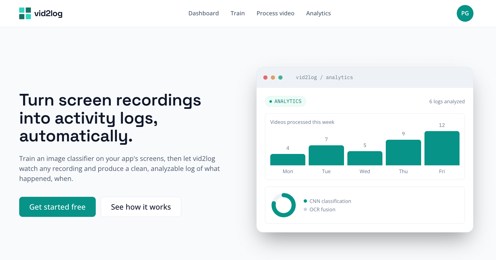
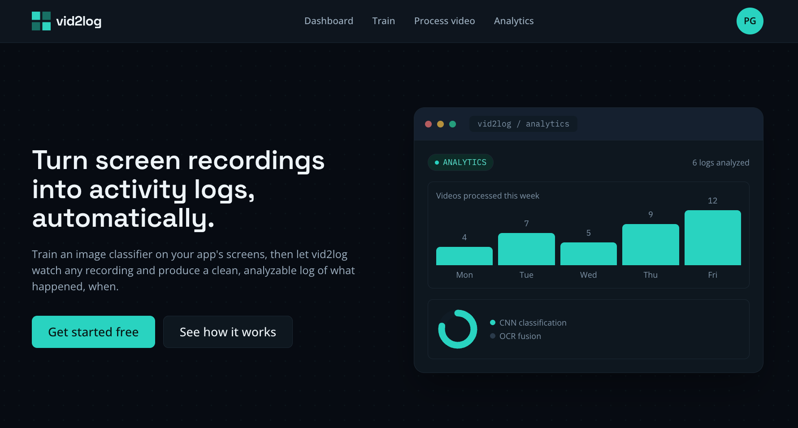
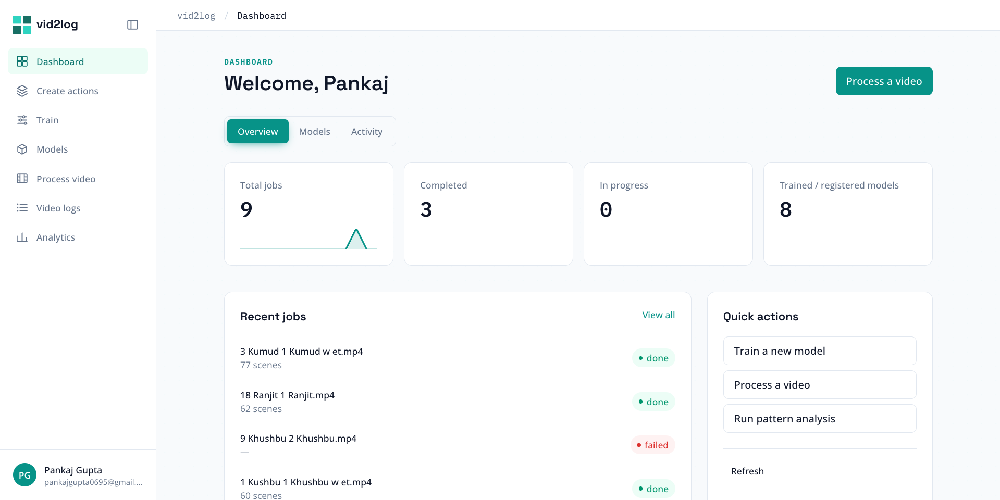
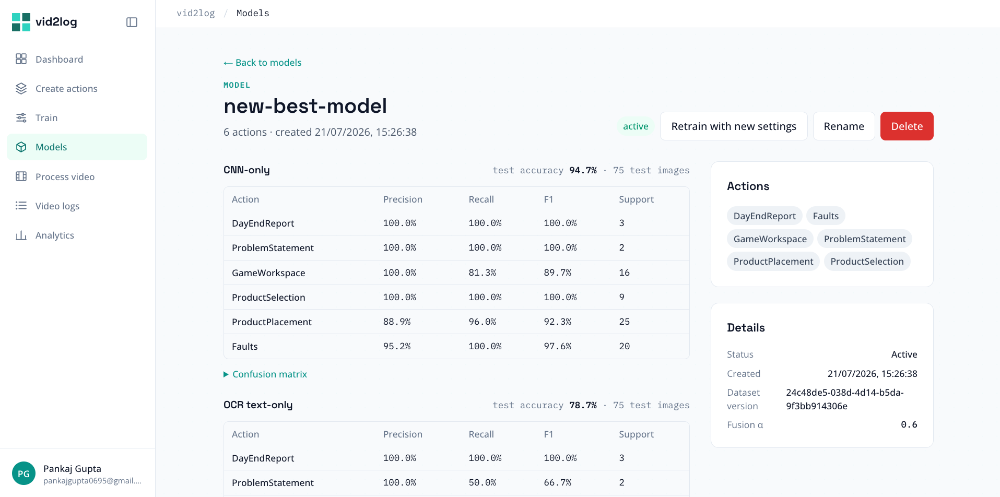
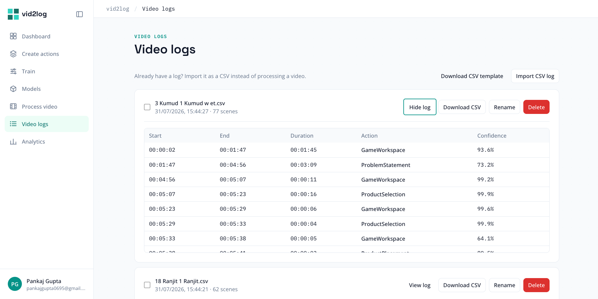
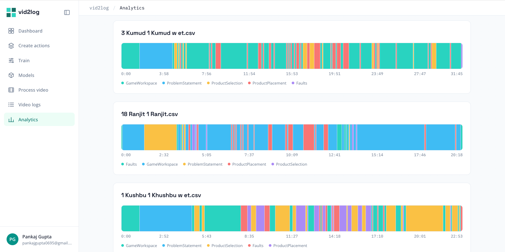
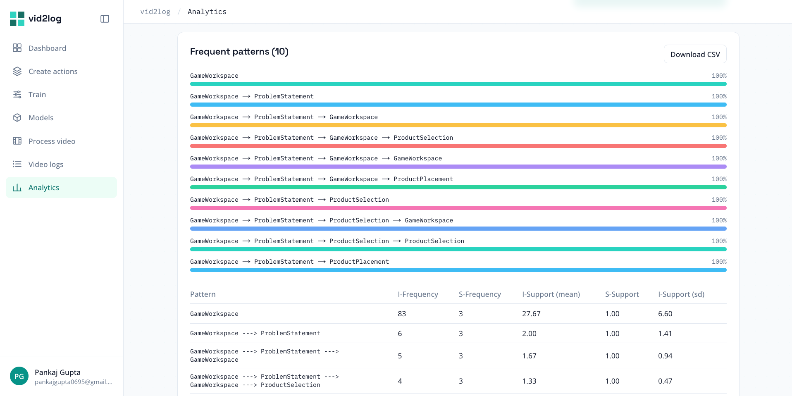

<div align="center">
  

  # vid2log

  **Turn screen recordings into structured activity logs, automatically.**

  Train an image classifier on your app's screens, then let vid2log watch any recording and produce a clean, timestamped, analyzable log of what happened, when. Ships as both a cloud web application and a fully offline desktop app.

  
  
  
  
  
  
</div>

---

## What it does

Producing an activity log used to mean training a model by hand with no test-set metrics, and feeding videos through a single-video script one at a time. vid2log replaces that with one application: train a classifier with a real evaluation report, process any number of recordings in parallel, and turn the resulting logs into decision-ready analytics.

It exists as two deliverables built around the same machine-learning pipeline:

- **The web app** (this repo's `frontend/` + `backend/`) — a multi-user, browser-based application deployed on Google Cloud Run. Best when you want shared access, no local install, and cloud-hosted processing.
- **The desktop app** (`vid2log/`) — a Flutter shell for macOS and Windows with an embedded, local Python engine. Runs entirely offline on `127.0.0.1`, with no video or data ever leaving the machine — for users who can't or don't want to send recordings to the cloud, or who need the tool to work without an internet connection. See [`vid2log/RELEASE.md`](vid2log/RELEASE.md) for packaging it into a `.dmg`/`.exe`, and [`vid2log/WINDOWS_BUILD_GUIDE.md`](vid2log/WINDOWS_BUILD_GUIDE.md) for a from-scratch Windows build walkthrough.

## Screenshots

<table>
  <tr>
    <td width="50%"><br /><sub>Landing page — light</sub></td>
    <td width="50%"><br /><sub>Landing page — dark</sub></td>
  </tr>
  <tr>
    <td><br /><sub>Dashboard — jobs, models, activity at a glance</sub></td>
    <td><br /><sub>Model detail — CNN + OCR fusion metrics</sub></td>
  </tr>
  <tr>
    <td><br /><sub>Scene-by-scene video logs</sub></td>
    <td><br /><sub>Video timeline</sub></td>
  </tr>
  <tr>
    <td colspan="2"><br /><sub>Analytics — sequential pattern mining</sub></td>
  </tr>
</table>

## Features

- **CNN + OCR fusion classification** — a TensorFlow CNN classifier fused with Tesseract-based OCR text extraction, so visually near-identical screens still get told apart. Every training run reports CNN-only, OCR-only, and fused metrics side by side.
- **Auto-discover actions** — upload a demo recording and vid2log clusters it into candidate actions automatically (DINOv2 embeddings + HDBSCAN clustering). Review, merge, rename, and drag images between actions before saving a reusable action dataset.
- **Real test-set metrics** — a genuine train/val/test split with accuracy, per-action precision/recall/F1, and a confusion matrix, not just training accuracy.
- **Model registry** — every trained model versioned with its dataset and metrics; compare, activate, retrain, or roll back at any time.
- **Parallel batch processing** — queue any number of recordings; a pool of background workers processes them independently.
- **Scene-by-scene logs** — a timestamped activity log per video with per-scene confidence, viewable in-app, exportable as CSV, or importable from an existing CSV.
- **Pattern mining** — Sequential Pattern Mining (SPM) surfaces common workflows; Differential Sequence Mining (DSM) shows what statistically differs between two groups of sessions.
- **Reporting** — one-click PDF/CSV export of aggregate analytics.
- **Light/dark theme**, role-based access (user/admin), and a responsive dashboard shell throughout.
- **Offline desktop app** — the same training, processing, action-discovery, and analytics workflow packaged as a native macOS/Windows app with a local Python engine in place of the cloud backend (SQLite instead of Firestore, local files instead of Cloud Storage). See [Desktop app](#desktop-app-offline) below.

## Tech stack

| Layer              | Technology                                                                 |
| ------------------ | --------------------------------------------------------------------------- |
| Frontend           | Next.js 16 (App Router), React 19, TypeScript, Tailwind CSS v4              |
| Auth                | Firebase Authentication (email/password + Google)                          |
| Backend API         | FastAPI                                                                     |
| Database            | Firestore — jobs, models, users, action datasets                           |
| File storage        | Standalone Google Cloud Storage bucket via signed uploads (not Firebase Storage) |
| Job queue           | Redis + RQ — separate queues for video processing, training, and action discovery |
| Classification      | TensorFlow / tf-keras (CNN, transfer learning) fused with Tesseract OCR (`pytesseract`) |
| Action discovery    | PyTorch + Transformers (DINOv2 embeddings) + HDBSCAN clustering            |
| Analytics           | scikit-learn, SciPy, pandas — SPM/DSM pattern mining and statistical tests |
| Reporting           | jsPDF                                                                       |
| Desktop app         | Flutter (macOS/Windows) shell + an embedded local Python/FastAPI "sidecar" — SQLite instead of Firestore, local filesystem instead of Cloud Storage, no auth layer (single local user) |
| Desktop packaging   | PyInstaller (frozen Python sidecar, bundled Tesseract) + `.dmg` / Inno Setup `.exe` installers |

## Architecture

```
Next.js frontend  ──── Firebase Auth (sign-in)
      │
      │ REST, Bearer ID token
      ▼
FastAPI backend ──────────────────────► Firestore (jobs, models, users, datasets)
      │
      ├──► Cloud Storage      (signed uploads: temp video/image blobs, permanent model files)
      │
      └──► Redis ──► RQ workers
                       ├─ video_processing    CNN + OCR classification → scene log
                       ├─ training            fine-tune classifier, report test metrics
                       └─ action_discovery    DINOv2 embeddings + HDBSCAN clustering
```

The frontend never talks to Firestore or Cloud Storage directly — every read/write goes through the FastAPI backend, and files are uploaded straight from the browser to Cloud Storage via short-lived signed URLs (raw bytes never touch the API server). See `backend/README.md` for the full storage lifecycle and why it moved off Firebase Storage.

The desktop app mirrors this same shape entirely locally — no network calls at all once installed:

```
Flutter shell (macOS/Windows)
      │  spawns + talks to over 127.0.0.1 only
      ▼
Local Python "sidecar" (FastAPI) ───► SQLite   (jobs, models, action datasets)
      │
      └──► ~/.vid2log/  (trained models, saved datasets, sidecar logs — local filesystem, no queue needed)
```

It runs the identical CNN + OCR fusion classifier, action-discovery clustering, and SPM/DSM analytics engine as the web backend, just single-user and synchronous instead of multi-tenant and queued. See [Desktop app](#desktop-app-offline) below.

## Project structure

```
vid2log/
├── frontend/               Next.js app — dashboard, training, analytics UI
├── backend/                FastAPI app, RQ workers, and ML pipelines (cloud web app)
├── vid2log/                Flutter desktop app (macOS/Windows) + embedded Python sidecar
│   ├── lib/                 Flutter UI — dashboard, train, process, create actions, analytics
│   ├── python_sidecar/      Local FastAPI engine — same ML pipeline as backend/, SQLite instead of Firestore
│   ├── scripts/             build_macos.sh, build_windows.ps1, installer.iss, make_app_icon.py
│   ├── RELEASE.md           Packaging guide — .dmg (macOS) and .exe (Windows)
│   └── WINDOWS_BUILD_GUIDE.md  From-scratch Windows build walkthrough
├── streamlit_application/  Original single-video prototype this project replaces
└── *.md, *.ipynb           Design docs and the DINOv2/HDBSCAN research notebook
```

## Getting started

**Prerequisites:** Node.js 20+, Python 3.11, Redis, Tesseract OCR, a Firebase project (Auth + Firestore), and a standalone Google Cloud Storage bucket.

```bash
# Backend
cd backend
python3.11 -m venv .venv && source .venv/bin/activate
pip install -r requirements.txt
cp .env.example .env              # fill in Firebase, GCS, and Redis config
python -m uvicorn app.main:app --reload --port 8000   # API on :8000
python -m app.worker                                  # separate terminal — run more for more parallel jobs
```

```bash
# Frontend
cd frontend
npm install
cp .env.local.example .env.local  # fill in Firebase web config + API URL
npm run dev                       # app on :3000
```

Or run the backend with `docker compose up --build` from `backend/`. Full setup details — Firebase project setup, Cloud Storage bucket/CORS/IAM, and troubleshooting — live in [`backend/README.md`](backend/README.md) and [`frontend/README.md`](frontend/README.md).

## Desktop app (offline)

**Prerequisites:** Flutter SDK, Python 3.11, and the Tesseract OCR binary. No Firebase, GCS, or Redis needed — everything runs locally.

```bash
# One-time: set up the embedded Python engine
cd vid2log/python_sidecar
python3.11 -m venv .venv && source .venv/bin/activate   # Windows: .venv\Scripts\activate
pip install -r requirements.txt

# Run the app in development mode
cd ..
flutter pub get
flutter run -d macos     # or: flutter run -d windows
```

The Flutter app spawns the Python sidecar itself on `127.0.0.1` — no separate terminal needed once it's running. See [`vid2log/python_sidecar/README.md`](vid2log/python_sidecar/README.md) for how the sidecar works standalone.

To produce a distributable installer:

- **macOS → `.dmg`:** [`vid2log/RELEASE.md`](vid2log/RELEASE.md) — one script (`scripts/build_macos.sh`), optional code signing and notarization.
- **Windows → `.exe`:** [`vid2log/WINDOWS_BUILD_GUIDE.md`](vid2log/WINDOWS_BUILD_GUIDE.md) — a complete from-scratch walkthrough (Flutter SDK, Visual Studio C++ workload, Python 3.11, Tesseract, Inno Setup) through to `scripts\build_windows.ps1` and the final installer.

## Deployment

Step-by-step instructions for deploying the full stack (API, background worker, frontend) to Google Cloud Run, including Memorystore, IAM, and Artifact Registry setup, are in [`DEPLOYMENT.md`](DEPLOYMENT.md). The background worker runs as a Cloud Run **Job**, triggered per-enqueue and scaling to zero when idle, rather than an always-on worker pool.

The desktop app has no cloud deployment step — "deploying" it means producing and distributing the `.dmg`/`.exe` installers above.

---

<div align="center">
  <sub>Built for IIT Bombay research & learning-platform video analysis.</sub>
</div>
